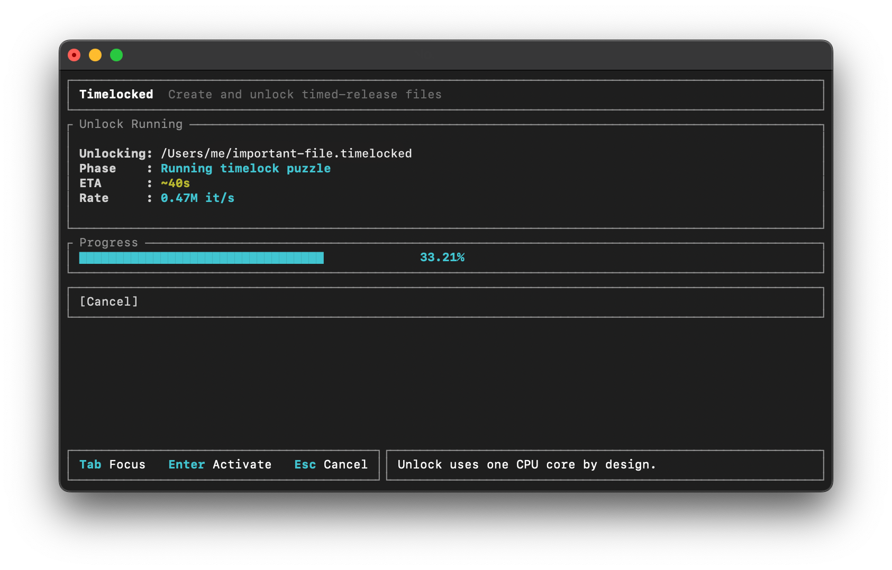

# Timelocked

Encrypt any file and enforce delay before decryption.

<p align="center">
  
</p>


## What is it ?

Timelocked is a portable desktop application that allow to create and unlock timed-release files. Unlocking a timelocked file requires time (minutes, hours, days or more). The delay is chosen at creation time.

Timelocking a file encrypts your content with a random key, then protects that key with sequential work
(time-lock puzzle), so unlock time is based on compute work.

Technically, it uses an RSW-style repeated-squaring time-lock puzzle to protect the key (see [paper](https://people.csail.mit.edu/rivest/pubs/RSW96.pdf)). Only one CPU can be used to unlock a file, so parallelization is not possible.


## What is it not ?

Timelocked is not a cloud service, it is a local application. It does not require an account and does not connect to the internet at any time. There is no embedded telemetry.

A precise decryption delay is not ensured. The delay is estimated based on the hardware profile selected. Faster hardware will unlock a file faster.

Timelocked does not prevent the original file from being copied, deleted, or modified.

## What could it be used for ?

#### Inheritance

Timelock your documents/passwords with a relatively long delay, let say 10 days. Put them in a usb stick along with the timelocked application and some clear text instructions. Put the usb stick in a temper-evident bag. Put the bag in your home safe and tell your family about it. 

If something bad happens to you, your family can open the safe. They would use the usb stick to unlock your documents after more or less 10 days.

If your safe is compromised, or if you see that the temper-evident bag was opened, you have time to change your passwords.

#### Denfend your cryptocurrencies againt $5 wrench attack

<p align="center">
  
</p>


Timelock a BIP39 passphrase and use temporary passphrase setup on your hardware wallet. 
Tell attackers that came to your house for your crypto currencies that you don't have access to funds right now. You don't have to lie or omit anything, it's easier to tell the truth under pressure. You can prove it to them by showing your whole setup (even this page). Hopefully, they'll think that the risk/reward ratio is not in their favor anymore.

#### Help handling digital addiction

Lock un-memorable online betting site password from direct access. If you have to wait 30 minute before logging, it can give you enough time to reduce the urge to bet.

This can also work for online games, social networks, etc..

# Features

- Any file extension supported
- Completely offline local app - no usage of internet, no telemetry.
- Portable windows, macos, linux - you can put it in a usb stick
- Lightweight - ~3 Mb
- Minimal dependences for reduced obsolescence risks - should hopefully work in 20 years 
- CLI and TUI - minimal, stable, resilient UI
- Built-in benchmark to estimate unlock duration on your machine (calibration)
- State of the art AEAD encryption - ensure data integrity
- Recoverability from file corruption - data redundancy with Reed-Solomon algorithm
- Backward compatibility - future versions will unlock file locked years before

## Download

TODO: link

## FAQ

### How does Timelocked work?

Timelocked turns a file or message into a locked package (a file ending in `.timelocked`). Anyone can copy and keep that package, but opening it requires making a computer do a long, step-by-step calculation. Because each step depends on the previous one, there is no practical way to "skip ahead" and open it early.
Technically, the `lock` phase generates a random symmetric key `K`, encrypts the original file/message with AEAD, and stores the ciphertext in the timelocked file payload. `K` is then time-locked using an RSW-style repeated-squaring time-lock puzzle parameterized by `T` iterations. `unlock` performs the sequential work to recover `K`, then decrypts the payload back to the exact original bytes.


### Can a timelocked file be hacked?

The goal is that the only realistic way to open a `.timelocked` file early is to do the same long computation you would normally do. There isn't supposed to be a clever trick that jumps to the end. 
Timelocked is designed so there is no known practical shortcut to recover the cryptographic key `K` faster than the required sequential work (for the chosen parameters and assumptions). It is based on Rivest-Shamir-Wagner, "Time-lock puzzles and timed-release crypto" (1996): https://people.csail.mit.edu/rivest/pubs/RSW96.pdf

Important nuance:

- Timelocked protects confidentiality and integrity of the content.
- It does not stop copying, deleting, or withholding the `.timelocked` file.
- If an attacker tampers with file bytes, integrity checks (AEAD) should make unlock fail explicitly.


### What about supercomputers or quantum computers?

Faster computers can do the required work faster, so the "delay" can be shorter on very powerful hardware. If your use case is important, choose a conservative delay and add a safety margin.
Quantum computer are way better for certains usecases like factorisation and parralelization. As the Timelocked solution use sequential work, it will still need time to unlock a file. Howerver, if future quantum capabilities can break assumptions behind the time-lock construction, format/algorithm migration will be required.


### Does Timelocked unlock at an exact date/time?

No. Timelocked enforces "do this much work" rather than "unlock at this exact date and time". The actual duration depends on the machine that unlocks it and what that machine is doing (power mode, temperature/thermals, background load).


### Can the creator/sender cheat and unlock instantly?

The creator already has the original content at creation time. If they keep a copy (or share the key some other way), they can read it immediately. Timelocked is meant to delay access for someone who only receives the `.timelocked` file (or the for creator if they make sure to delete/forget the original content).


### What if I lose the original file and/or the `.timelocked` file?

Timelocked is not a backup solution. If you lose both the original file/message and the `.timelocked` file, the content is gone. If you lose the original but still have the `.timelocked` file, you can unlock later and recover the original. If you lose the `.timelocked` file but still have the original, you still have your content - you just don't have the timelocked copy anymore. If it matters, keep multiple backups of the `.timelocked` file and the Timelocked portable apps.


### Can a corrupted timelocked file be recovered?

Sometimes, yes.

Timelocked v1 stores the encrypted payload with Reed-Solomon redundancy, so some limited damage in the payload region can be repaired during recovery. This is meant to help with a small amount of storage corruption or transmission damage.

Important limits:

- Recovery is not guaranteed for arbitrary corruption.
- The file can only be repaired when the damage stays within the stored redundancy budget.
- The recovery metadata also has to remain usable. Timelocked stores 2 authoritative superblock copies so it can survive some damage there too.
- If the file is too damaged, Timelocked fails explicitly rather than silently producing wrong bytes.

In practice: minor corruption may be recoverable, but Timelocked is not a substitute for keeping backups.


### Why do we need AEAD in Timelocked?

Encryption keeps the content private until the unlock work is done. AEAD adds a tamper-evident seal: if the `.timelocked` file is corrupted or modified, Timelocked can detect that and fail loudly instead of producing wrong output.

AEAD (Authenticated Encryption with Associated Data) is required because it gives us both:

- **Confidentiality**: protects content from being read before `K` is recovered.
- **Integrity/authenticity** (with respect to `K`): detects tampering and corruption.

This is important for Timelocked files because:

- A time-lock puzzle enforces delay, but does not prevent an attacker from modifying bytes in the timelocked file.
- Without AEAD, modified ciphertext could produce silent bit flips in recovered output.
- Timelocked files are portable, offline, and long-lived; data may be moved or stored for years, so corruption/tampering detection is critical.
- With chunked encryption, AEAD tags and associated data can bind chunk index and relevant header context to prevent chunk swapping/reordering attacks.

In short: the time-lock controls **when** `K` is obtained; AEAD ensures decrypted output is the **exact original bytes** once `K` is obtained.


### Does AEAD prove who created a Timelocked file?

No. AEAD can tell you "this was decrypted with the right key and wasn't modified", but it can't tell you *who* created it. Proving authorship requires a separate digital signature.


## Documentation

- [Domain language](docs/domain-language.md)
- [Binary file format](docs/binary-file-format.md)
- [Architecture](docs/architecture.md)


## Install

There is no installation, the binary is portable and can be launched as is. It can be copied in a USB stick or anywhere on your computer.

## Usage

Run by double clicking or by launching it from a terminal. It will launch the Terminal User Interface (TUI) per default.


### CLI Usage

Timelocked can optionnaly be commanded by terminal arguments.

#### 1) Lock a file

Using target delay + hardware profile:

```bash
timelocked lock ./secret.txt --target 7d --hardware-profile desktop-2026
```

Using explicit `--in` + iterations:

```bash
timelocked lock --in ./secret.txt --iterations 500000
```

Default output is `<input>.timelocked` in the same directory.
If you pass `--out` without `.timelocked`, the extension is added automatically.

#### 2) Lock text input

When input text is passed directly, `--out` is required (and `.timelocked` is auto-added if missing):

```bash
timelocked lock "Hello future" --out ./hello.timelocked --target 3d
```

#### 3) Lock from stdin

When using `--in -`, `--out` is required (and `.timelocked` is auto-added if missing):

```bash
echo "Hello future" | timelocked lock --in - --out ./hello.timelocked --target 3d
```

#### 4) Inspect a timelocked file

```bash
timelocked inspect ./secret.txt.timelocked
```

#### 5) Verify a timelocked file

```bash
timelocked verify ./secret.txt.timelocked
```

#### 6) Unlock

Default output path (same dir, original filename if known):

```bash
timelocked unlock ./secret.txt.timelocked
```

If the chosen output file already exists, unlock keeps your existing file and writes to
an incremented name like `secret.1.txt`, `secret.2.txt`, and so on.

If the timelocked file contains an original message (no `original_filename` in header),
unlock prints the recovered message to CLI output and does not write a file.
In this case, `--out` and `--out-dir` are invalid and unlock returns an error.

Custom output directory:

```bash
timelocked unlock --in ./secret.txt.timelocked --out-dir ./out
```

## Safety and Behavior

- No silent overwrite: `lock` fails if output exists; `unlock` auto-picks `name.N.ext`.
- `--json` prints machine-readable progress/result events.
- The TUI main menu includes a short reminder that delays are enforced by sequential work and remain estimates.


## Development

### Build requirements

- Rust toolchain (stable)
- Cargo

`rust-toolchain.toml` is included to pin the toolchain for this repository.

### Build and Compile

- Debug build:

```bash
cargo build
```

- Release build:

```bash
cargo build --release
```

- Run compiled binary:

```bash
./target/release/timelocked --help
```

### Run Locally

- Run CLI directly with Cargo:

```bash
cargo run -- --help
```

- Launch the TUI (default when no args are provided):

```bash
cargo run --
```

- Show command help:

```bash
cargo run -- lock --help
cargo run -- unlock --help
cargo run -- inspect --help
cargo run -- verify --help
```


## Run Tests

- Run full test suite:

```bash
cargo test
```

- Run integration CLI tests only:

```bash
cargo test --test cli_mvp
```

- Run coverage check for `src/domains` + `src/usecases`:

```bash
python3 scripts/check_domains_usecases_coverage.py
```

You can override the minimum coverage threshold (default `92.0`):

```bash
python3 scripts/check_domains_usecases_coverage.py --threshold 95
```

## Project Docs

Product and technical docs are in `docs/`.

## License

This project is dual-licensed under either of the following, at your option:

- MIT License (`LICENSE-MIT`)
- Apache License, Version 2.0 (`LICENSE-APACHE`)
